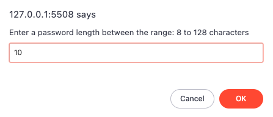
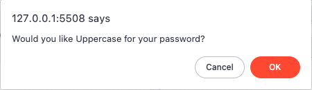
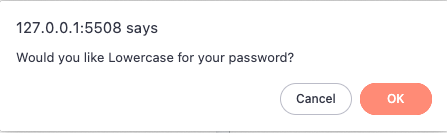
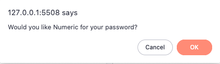
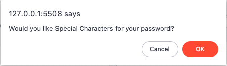
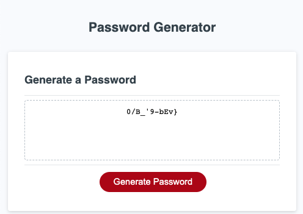

# Module 5 Challenge: Password Generator

## Description
 
			For this project given the outline of my On-the-job ticket, my main objectives is to:
	
				•	Create an application that an employee can use generate to a random password 
					using the criteria which they have selected from a series of prompts presented to
					them. 

				•	To achieve this aim, the application will run in the browser implementing dynamically
					updated HTML and CSS content using JavaScript code to interact with the HTML page 
					elements.

## User Story

    With this in mind, logically thinking through user actions was of key importance as a guide to creating JavaScript code to interact with user responses. Being able to validate the user input and account for possible incorrect entries is another factor. 

		By initially drafting out some pseudocode, one was able to scope out some of the lightly bottlenecks ahead of the taskt. Most notably, was establishing how to retrieve user responses via a modal interface successfully. Then store and use the information to define the user selected options. Although this did not appear apparent to me until the start of Module 6 of my course, once noted, it was acted upon. 

		Another was using a random number method to aid in generating a random password with data now 
		obtained from the user. This process was overcome through research on the matter on how best to organise the data so that it can be efficiently accessed to select items from it.  

## Acceptance Criteria

        GIVEN A series of prompts for password criteria
		WHEN User is presented with dialog field  
		THEN  User inputs the requested information  

		GIVEN User input 
		WHEN Received successfully 
		THEN  User input should be validated 

		GIVEN Incorrect user input
		WHEN Received 
		THEN  User is requested to enter information again 

		GIVEN Successful user input validation 
		WHEN Received 
		THEN  Application logs and stores the data 

		GIVEN All prompts have been answered 
		THEN  The password should be generated and displayed / written to the page

Expected presention to user: 

Screenshot of 1st Password Generator Prompt:

Screenshot of 2nd Password Generator Prompt:

Screenshot of 3rd Password Generator Prompt:

Screenshot of 4th Password Generator Prompt:

Screenshot of 5th Password Generator Prompt:

Screenshot of Password Generated using the above Prompt Inputs: 

## Page Link
https://44-khowell.github.io/Password-Generator/

## Credits

Tutorials: 

- https://www.youtube.com/watch?v=dW-aWDLV44c

References: 

- https://developer.mozilla.org/en-US/docs/Web/API/Window/confirm
- https://stackoverflow.com/questions/1584370/how-to-merge-two-arrays-in-javascript-and-de-duplicate-items
- https://stackoverflow.com/questions/9651484/how-do-i-get-a-return-value-from-a-button-click-event

## License 

Copyright (c) Keith Howell

Permission is hereby granted, free of charge, to any person obtaining a copy
of this software and associated documentation files (the "Software"), to deal
in the Software without restriction, including without limitation the rights
to use, copy, modify, merge, publish, distribute, sublicense, and/or sell
copies of the Software, and to permit persons to whom the Software is
furnished to do so, subject to the following conditions:

The above copyright notice and this permission notice shall be included in all
copies or substantial portions of the Software.

THE SOFTWARE IS PROVIDED "AS IS", WITHOUT WARRANTY OF ANY KIND, EXPRESS OR
IMPLIED, INCLUDING BUT NOT LIMITED TO THE WARRANTIES OF MERCHANTABILITY,
FITNESS FOR A PARTICULAR PURPOSE AND NONINFRINGEMENT. IN NO EVENT SHALL THE
AUTHORS OR COPYRIGHT HOLDERS BE LIABLE FOR ANY CLAIM, DAMAGES OR OTHER
LIABILITY, WHETHER IN AN ACTION OF CONTRACT, TORT OR OTHERWISE, ARISING FROM,
OUT OF OR IN CONNECTION WITH THE SOFTWARE OR THE USE OR OTHER DEALINGS IN THE
SOFTWARE.